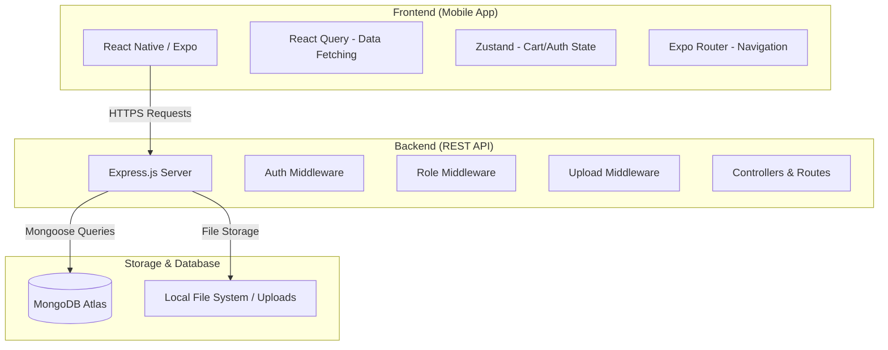
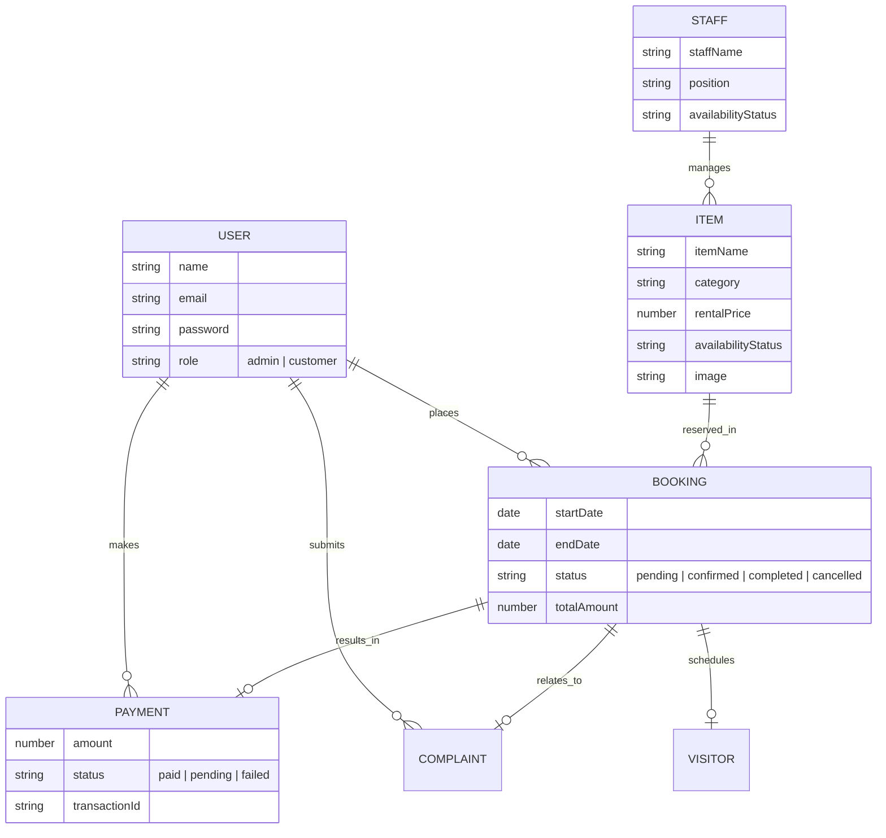

# Favo - Fashion Rental & Outfit Management System
## Detailed Implementation Documentation

---

## 1. Executive Summary
**Favo** is a premium, full-stack digital ecosystem designed for the fashion rental industry. It bridges the gap between high-end fashion accessibility and sustainable consumption by providing a platform for renting luxury outfits. The system features a sophisticated mobile interface for customers and a comprehensive administrative dashboard for business management.

---

## 2. Technology Stack

### Frontend (Mobile Application)
- **Framework**: React Native with **Expo SDK 54**.
- **Navigation**: **Expo Router** (File-based routing) for seamless transitions.
- **Language**: **TypeScript** for type-safe development.
- **State Management**: **TanStack React Query** for efficient server-side state synchronization and **Zustand** for lightweight client-side state.
- **Styling**: Custom theme system implementing a "Luxury Wonder" aesthetic with **Inter** and **Outfit** typography.
- **API Communication**: **Axios** with centralized configuration and interceptors.
- **Persistence**: **AsyncStorage** for local session management.

### Backend (RESTful API)
- **Runtime**: **Node.js** with **Express.js** framework.
- **Database**: **MongoDB Atlas** (Cloud Database) with **Mongoose ODM**.
- **Authentication**: **JSON Web Token (JWT)** with role-based access control (RBAC).
- **Security**: **Bcrypt.js** for password hashing and custom middleware for route protection.
- **File Handling**: **Multer** for processing multi-part form data (images).
- **Environment**: Managed via `.env` files for production/development parity.

---

## 3. System Architecture

### 3.1. Architectural Overview
The system follows a Client-Server architecture where the React Native mobile app communicates with a Node.js backend via a secure REST API.



---

## 4. Database Schema (ERD)

The database consists of 7 core collections with complex relationships established through MongoDB ObjectIds.



---

## 5. Module Implementation Details

### 5.1. Authentication Module
- **Features**: Registration, Login, Profile Management.
- **Logic**: Uses JWT stored in AsyncStorage. Middleware checks token validity and role (Admin/Customer) before allowing access to specific routes.

### 5.2. Item Management (Inventory)
- **Admin**: Full CRUD operations. Supports image uploads via Multer.
- **Customer**: Browsing, searching, and filtering by category/size.
- **Status Tracking**: Tracks "Available", "Rented", and "Maintenance" states.

### 5.3. Booking & Rental Module
- **Logic**: Handles date-range selection, calculates total rental costs including deposits, and prevents double-booking of items.
- **Workflow**: Customer requests -> Admin approves -> Payment processed -> Rental starts.

### 5.4. Payment & Financials
- **Features**: Transaction history, automated transaction ID generation.
- **Utility**: Helps admins assign tasks or track who is managing specific inventory.

### 5.5. Staff & Support
- **Features**: Manage internal staff profiles and availability.
- **Utility**: Helps admins assign tasks or track who is managing specific inventory.

### 5.6. Complaint System
- **Features**: Customers can submit complaints with images. Admins can respond and update status (Open -> Resolved).

### 5.7. Visitor & Appointment Module
- **Features**: Schedule pickups or returns. Supports status updates (Scheduled -> Completed).

---

## 6. API Documentation Summary

| Module | Method | Endpoint | Description | Access |
| :--- | :--- | :--- | :--- | :--- |
| **Auth** | POST | `/api/auth/login` | Authenticate & get token | Public |
| **Auth** | POST | `/api/auth/register` | Create new account | Public |
| **Items** | GET | `/api/items` | List all items | Public |
| **Items** | POST | `/api/items` | Add new item with image | Admin |
| **Bookings** | POST | `/api/bookings` | Create rental request | Customer |
| **Bookings** | GET | `/api/bookings` | View all rentals | Admin |
| **Payments** | GET | `/api/payments/my` | View payment history | Customer |
| **Complaints**| POST | `/api/complaints` | Submit feedback/issue | Customer |
| **Visitors** | POST | `/api/visitors` | Schedule pickup/return | Customer |

---

## 7. Frontend User Experience

### 7.1. Aesthetic Design
- **Theme**: "Wonder" Luxury - minimal, high-contrast, editorial layout.
- **Colors**: Ink (#000000), Cream (#F9F8F6), Camel (#C2996B).
- **Interactions**: Smooth transitions using React Native Reanimated (where applicable) and consistent button/input styling.

### 7.2. Key Screens
- **Dashboard (Admin)**: Visual summary of bookings, items, and revenue.
- **Home (Customer)**: Featured items and quick category navigation.
- **Cart/Checkout**: Multi-step process for secure booking.
- **Management Screens**: Unified table/list views for all admin CRUD operations.

---

## 8. Deployment & Configuration

### 8.1. Environment Configuration
The project uses separate `.env` files for frontend and backend:
- **Backend**: Contains sensitive keys like `JWT_SECRET` and `MONGO_URI`.
- **Frontend**: Contains `EXPO_PUBLIC_API_URL` for pointing to the hosted backend.

### 8.2. Directory Structure
```text
/Favo-Mobile
├── backend/            # Express.js Server
│   ├── controllers/    # Business Logic
│   ├── models/         # Mongoose Schemas
│   ├── routes/         # API Endpoints
│   └── server.js       # Entry Point
├── frontend/           # React Native / Expo App (formerly 'expo')
│   ├── app/            # File-based Routes
│   ├── components/     # UI Design System
│   ├── api/            # Axios Service Layers
│   └── context/        # Global State Providers
└── README.md           # Setup Instructions
```

---

## 9. Implementation Status
- [x] Backend API Architecture & DB Setup
- [x] JWT Authentication & Role Middleware
- [x] Item CRUD & Image Uploads
- [x] Booking Logic & Workflow
- [x] Payment History & Tracking
- [x] Complaint & Visitor Management
- [x] Luxury UI Theme Implementation
- [x] Reorganized Directory Structure (`expo` -> `frontend`)

---
*Last Updated: May 4, 2026*
