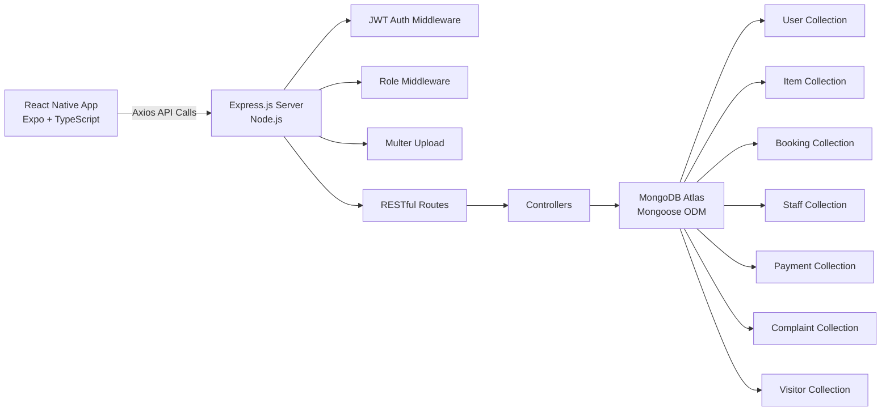
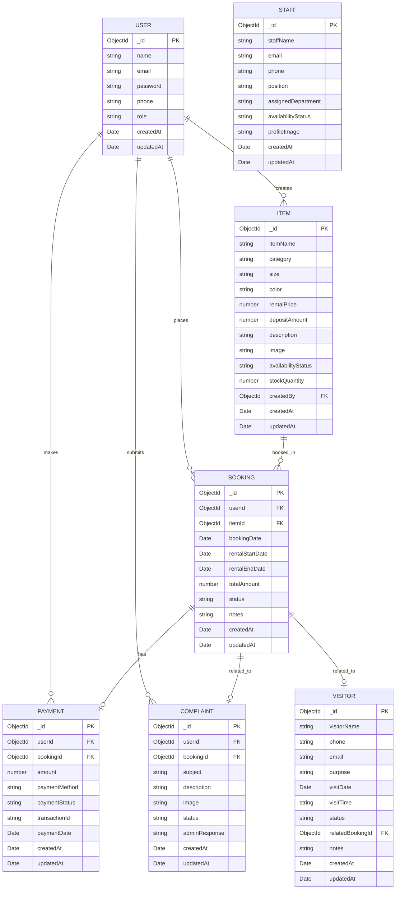

# Favo - Assignment Documentation

## 1. Problem Statement

Fashion is a fast-moving industry where individuals frequently need premium outfits for special occasions such as weddings, galas, corporate events, and photoshoots. However, purchasing high-end fashion items for one-time use is expensive and unsustainable. On the other hand, fashion rental businesses lack a modern digital platform to manage inventory, bookings, payments, and customer support efficiently.

**Favo** addresses this gap by providing a complete digital ecosystem that:
- Enables customers to browse, filter, and rent fashion items through a premium mobile interface.
- Allows admins to manage inventory, approve bookings, track payments, handle complaints, and schedule visitor appointments.
- Replaces manual paperwork and disconnected systems with a unified, cloud-connected platform.
- Supports image uploads for items and complaints, ensuring transparency and quality assurance.

By combining a React Native mobile app with a Node.js/Express REST API and MongoDB Atlas, Favo delivers a scalable, deployable solution for fashion rental businesses.

---

## 2. System Architecture Diagram



---

## 3. Database Schema Diagram (ERD)



---

## 4. API Endpoint Table

| Method | Endpoint | Description | Access | Module |
|--------|----------|-------------|--------|--------|
| POST | /api/auth/register | Register new user | Public | Auth |
| POST | /api/auth/login | Login user | Public | Auth |
| GET | /api/auth/profile | Get profile | Protected | Auth |
| POST | /api/items | Create item | Admin | Item |
| GET | /api/items | Get all items | Public | Item |
| GET | /api/items/:id | Get single item | Public | Item |
| PUT | /api/items/:id | Update item | Admin | Item |
| DELETE | /api/items/:id | Delete item | Admin | Item |
| POST | /api/items/:id/upload | Upload image | Admin | Item |
| POST | /api/bookings | Create booking | Customer | Booking |
| GET | /api/bookings/my-bookings | My bookings | Customer | Booking |
| GET | /api/bookings | All bookings | Admin | Booking |
| PUT | /api/bookings/:id/status | Update status | Admin | Booking |
| PUT | /api/bookings/:id/cancel | Cancel booking | Customer | Booking |
| DELETE | /api/bookings/:id | Delete booking | Admin | Booking |
| POST | /api/staff | Create staff | Admin | Staff |
| GET | /api/staff | Get all staff | Admin | Staff |
| PUT | /api/staff/:id | Update staff | Admin | Staff |
| DELETE | /api/staff/:id | Delete staff | Admin | Staff |
| POST | /api/payments | Create payment | Customer | Payment |
| GET | /api/payments/my-payments | My payments | Customer | Payment |
| GET | /api/payments | All payments | Admin | Payment |
| PUT | /api/payments/:id/status | Update status | Admin | Payment |
| DELETE | /api/payments/:id | Delete payment | Admin | Payment |
| POST | /api/complaints | Create complaint | Customer | Complaint |
| GET | /api/complaints/my-complaints | My complaints | Customer | Complaint |
| GET | /api/complaints | All complaints | Admin | Complaint |
| PUT | /api/complaints/:id/status | Update status | Admin | Complaint |
| DELETE | /api/complaints/:id | Delete complaint | Admin | Complaint |
| POST | /api/visitors | Create visitor | Customer | Visitor |
| GET | /api/visitors | All visitors | Admin | Visitor |
| PUT | /api/visitors/:id/status | Update status | Admin | Visitor |
| DELETE | /api/visitors/:id | Delete visitor | Admin | Visitor |

---

## 5. Team Responsibility Breakdown

| Member | Entity | Focus Area | Backend Responsibilities | Frontend Responsibilities | Viva Focus |
|--------|--------|-----------|------------------------|--------------------------|------------|
| Shared | User | Authentication | Register API, Login API, JWT generation, Password hashing with bcrypt, Auth middleware, Protected routes | LoginScreen, RegisterScreen, AuthContext, AsyncStorage token handling | JWT flow, bcrypt, middleware chain |
| Member 1 | Item | Product / Inventory Management | Item model, CRUD APIs, Multer image upload, Category/size filters, Stock logic | ItemCard, ItemListScreen, ItemDetailsScreen, Admin items with create/delete | Multer upload, stock availability logic |
| Member 2 | Booking | Outfit Rental Booking | Booking model, Create booking, Approve/reject APIs, Cancel booking, Stock deduction/restoration | MyBookingsScreen, ManageBookingsScreen, CreateBookingScreen | Booking status flow, stock sync |
| Member 3 | Staff | Staff / Support Management | Staff model, CRUD APIs, Availability tracking | ManageStaffScreen, Staff cards | Admin-only access, staff schema |
| Member 4 | Payment | Financial Management | Payment model, Create payment, Transaction ID generation, Status updates | MyPaymentsScreen, ManagePaymentsScreen, Payment cards | Transaction ID generation, payment link to booking |
| Member 5 | Complaint | Customer Complaint System | Complaint model, Create complaint, Admin response, Status updates | CreateComplaintScreen, MyComplaintsScreen, ManageComplaintsScreen | Complaint lifecycle, admin response |
| Member 6 | Visitor | Visitor / Pickup Management | Visitor model, CRUD APIs, Status updates, Optional booking link | VisitorScheduleScreen, ManageVisitorsScreen | Visitor tracking, appointment scheduling |

---

## 6. Deployment Notes

### MongoDB Atlas Setup
1. Go to https://www.mongodb.com/atlas and create a free cluster.
2. Create a database user with read/write privileges.
3. Whitelist all IP addresses (`0.0.0.0/0`) for development.
4. Copy the connection string and paste it into `backend/.env` as `MONGO_URI`.

### Backend Deployment (Render)
1. Push the `backend/` folder to a GitHub repository.
2. Go to https://render.com and create a new Web Service.
3. Connect your GitHub repo and set the root directory to `backend`.
4. Set environment variables:
   - `MONGO_URI`: your Atlas connection string
   - `JWT_SECRET`: a strong random string
   - `NODE_ENV`: production
   - `PORT`: 5000 (Render will override this)
5. Deploy and copy the live URL (e.g., `https://favo-api.onrender.com`).

### Frontend Configuration
1. Open `frontend/api/axiosConfig.ts`.
2. Replace the placeholder URL with your deployed backend URL:
   ```ts
   const API_BASE_URL = 'https://favo-api.onrender.com';
   ```
3. Run the app locally with `bun run start` or build for distribution with EAS.

### Testing Live API Endpoints
Use tools like Postman or curl to test endpoints:
```bash
curl -X POST https://favo-api.onrender.com/api/auth/register \
  -H "Content-Type: application/json" \
  -d '{"name":"Admin","email":"admin@favo.com","password":"password","phone":"1234567890","role":"admin"}'
```

### Connecting Mobile App to Hosted Backend
- Ensure the `EXPO_PUBLIC_API_URL` environment variable or the hardcoded fallback in `axiosConfig.ts` points to the live backend.
- Test on a physical device or emulator with internet access.
- For iOS/Android production builds, update the API URL before building.
